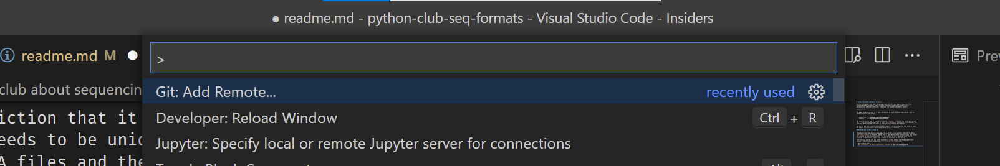
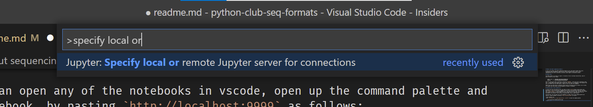
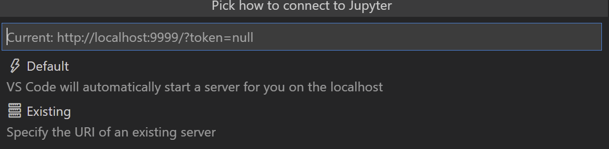
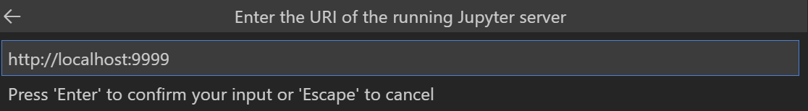

# Python club about sequencing formats I

In this first python club about sequencing formats we will talk about formats that store nucleotide level information. These file are often text-based (due to easy of early implementation and later convention) and have a wide range of information content.

## Running code in this problem set

In order to work with the material here, you need to install [docker](https://docs.docker.com/get-docker/). You can then start a notebook server with all the necessary libraries installed with `docker-compose up` from the command line in the repo directory. Then just open up a browser and navigate to http://localhost:9999. This will prompt you for a password, which will be disclosed in the lecture. You can then run code and edit files in your browser.

Alternatively, you can open any of the notebooks in vscode, open up the command palette and specify a remote notebook, by pasting `http://localhost:9999` as follows:

* Open notebook file
* Hit `ctrl+shift+P` or `magic-apple-button + shift+P` to open the command palette
    
* Type in `Specify local or remote jupyter server` 
    
* Click on `Existing`
    
* Type in `http://localhost:9999` and hit enter.
    
* Enter the secret password

If you want to run the tests for the three functions that you need to implement, run the following command form within the repo directory:`docker-compose -f run_tests.yml up`.